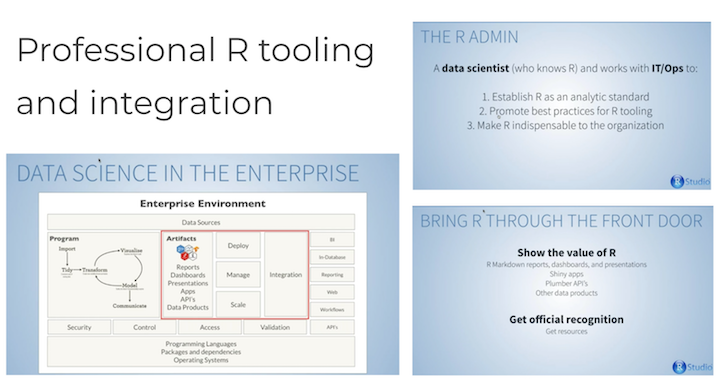

# UseR 2018 Session Talk

[UseR! 2018](https://user2018.r-project.org/) - Brisbane Australia

- Video Recording: [R Consortium on YouTube](https://www.youtube.com/watch?v=R7q9rAb2Qw4)
- Slide Deck: [Speaker Deck](https://speakerdeck.com/kellobri/devops-toolkit-for-r-tinkering-in-the-cloud)

### Resources Mentioned

- RStudio Webinar: [Professional Tooling and Integration](https://www.rstudio.com/resources/videos/professional-r-tooling-and-integration/)

- [The Unix Workbench](https://leanpub.com/unix/) By Sean Kross (`@seankross` on Twitter)
- [Building a Data Science Lab](https://github.com/sol-eng/data-science-lab)
- [Ansible Essentials Webinar](https://www.ansible.com/resources/webinars-training/introduction-to-ansible)
- [Ansible for DevOps](https://www.ansiblefordevops.com/) By Jeff Geerling (`@geerlingguy` on Twitter)
- [NGINX Webinar: Basics and Best Practices](https://www.nginx.com/resources/webinars/nginx-basics-best-practices-2/)

- Upcoming Webinar from RStudio: [Plumbing APIs with plumber](https://pages.rstudio.net/July25thPlumbingAPIswithplumber_Registration.html) July 25th 2018

### Google App Engine

- [Google App Engine](https://cloud.google.com/appengine/)
- [Custom Runtimes Documentation](https://cloud.google.com/appengine/docs/flexible/custom-runtimes/)
- [NGINX Quickstart Example](https://cloud.google.com/appengine/docs/flexible/custom-runtimes/quickstart)
