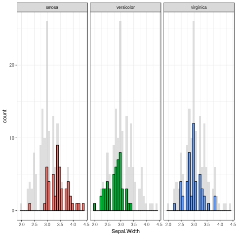

```{r setup, include=FALSE}
library(curl)
knitr::opts_chunk$set(echo = TRUE)
```

## R Plumber APIs

Extending R to Services!

```{r}
summary(iris)
```

## Description of Endpoints

Get Histograms:

* [/geom_hist?var=Sepal.Width](https://australia-plumber-app.appspot.com/geom_hist?var=Sepal.Width)
* [/geom_hist?var=Sepal.Length](https://australia-plumber-app.appspot.com/geom_hist?var=Sepal.Length) 
* /geom_hist?var=Petal.Width
* /geom_hist?var=Petal.Length

```{r}
# curl_download("https://australia-plumber-app.appspot.com/geom_hist?var=Sepal.Width", destfile = 'useR-nginx/www/geom-sepal-width.png')
```



